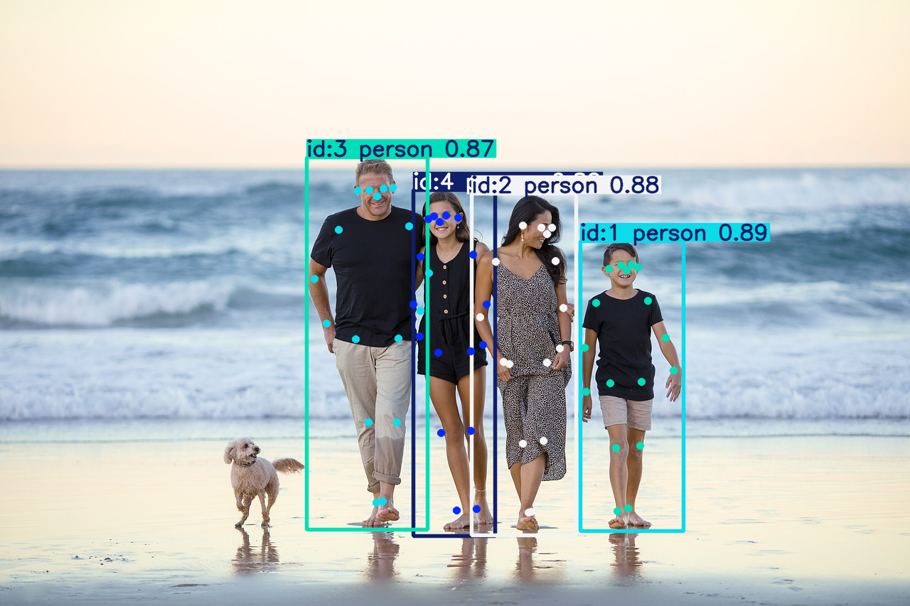
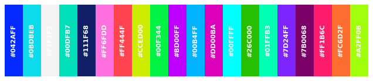

# YOLOv11n-pose-Tracker
YOLOv11 모델로 특정 객체 Pose감지 실습<br>
[블로그](https://blog.naver.com/yhm_it/223662614697)<br><br>

## 🖥️ 개발환경
* 
<br>

## ➡️ 흐름
1. YOLO Pose 모델을 사용하여 Key-point값 추출
2. YOLO Pose + Tracker 기능 추가<br>
   ① 고유 ID값에 따라 색상을 주어 시각화<br>
   ② 동영상에서 객체 추적하는 파라미터 추가<br>
   ③ results.py 파일을 통해 단순한 코드로 시각화<br>
   ④ ③의 코드를 참고하여 원하는 모양으로 시각화코드 수정<br>
3. 특정 사람만 지정하여 Key-point값 추적<br><br>

## 📒실행예제

### 1. YOLO 모델의 기능을 활용한 시각화
``` python
img = cv2.imread('/content/family.jpg')
results = model.track(img)

for result in results:
  img = result.plot(
      conf=True,
      kpt_radius=5,
      kpt_line=False,
      boxes=True,
      color_mode='instance'
  )

cv2_imshow(img)
```



▶️ Detection
   - color_mode = 'class': 클래스를 기준으로 색상 지정
   - color_mode = 'instance': ID를 기준으로 색상 지정
   - color_mode = None: 객체마다 고유 색상 지정

▶️ Segmentation
   - color_mode = 'class': 클래스를 기준으로 색상 지정
   - color_mode = 'instance': ID를 기준으로 색상 지정
   - color_mode = None: 객체마다 고유 색상 지정

▶️ Pose/Keypoints
   - color_mode = 'instance': 각 keypoint에 대해 고유한 색상 지정
   - color_mode != 'instance': keypoint를 번호에 따라 3가지 색상으로 구분<br><br><br>


### 2. ID에 따라 같은 색을 부여하는 Pose + Tracker
``` python
from ultralytics.utils.plotting import Colors
color_palette = Colors()

cap = cv2.VideoCapture('/content/cctv_assault_cut.mp4')

fourcc = cv2.VideoWriter_fourcc(*'mp4v')
out = cv2.VideoWriter('/content/out6.mp4', fourcc, 24, (int(cap.get(3)), int(cap.get(4))))

while cap.isOpened():
  ret, frame = cap.read()
  if not ret:
    break

  results = model.track(frame, tracker='botsort.yaml', persist=True)

  for result in results:
    # 바운딩박스
    x1, y1, x2, y2 = zip(*result.boxes.xyxy.cpu().numpy().astype(int))
    conf = result.boxes.conf.cpu().numpy().astype(float)
    id = result.boxes.id.cpu().numpy().astype(int)

    for i in range(len(id)):
      color = color_palette(id[i], True)
      key_x, key_y = zip(*result.keypoints.xy[i].cpu().numpy().astype(int))
      cv2.rectangle(frame, (x1[i], y1[i]), (x2[i], y2[i]), color, 2)
      cv2.putText(frame, f'ID:{id[i]}, Conf:{conf[i]:.2f}', (x1[i], y1[i] - 10),
                cv2.FONT_HERSHEY_SIMPLEX, 0.9, color, 2, lineType=cv2.LINE_AA)

      # 키포인트값
      for j in range(len(key_x)):
        cv2.circle(frame, (key_x[j], key_y[j]), 6, color, -1, lineType=cv2.LINE_AA)

  out.write(frame)

cap.release()
out.release()
cv2.destroyAllWindows()
```

<br><br><br>
### 3. 특정 ID의 Pose + Tracker
``` python
om ultralytics.utils.plotting import Colors
color_palette = Colors()

cap = cv2.VideoCapture('/content/cctv_assault_cut.mp4')

fourcc = cv2.VideoWriter_fourcc(*'mp4v')
out = cv2.VideoWriter('/content/out7.mp4', fourcc, 24, (int(cap.get(3)), int(cap.get(4))))

while cap.isOpened():
  ret, frame = cap.read()
  if not ret:
    break

  results = model.track(frame, tracker='botsort.yaml', persist=True)

  for result in results:
    # 바운딩박스
    x1, y1, x2, y2 = zip(*result.boxes.xyxy.cpu().numpy().astype(int))
    conf = result.boxes.conf.cpu().numpy().astype(float)
    id = result.boxes.id.cpu().numpy().astype(int)

    for i in range(len(id)):
      color = color_palette(id[i], True)
      key_x, key_y = zip(*result.keypoints.xy[i].cpu().numpy().astype(int))
      cv2.rectangle(frame, (x1[i], y1[i]), (x2[i], y2[i]), color, 2)
      cv2.putText(frame, f'ID:{id[i]}, Conf:{conf[i]:.2f}', (x1[i], y1[i] - 10),
                cv2.FONT_HERSHEY_SIMPLEX, 0.9, color, 2, lineType=cv2.LINE_AA)

      # 키포인트값
      for j in range(len(key_x)):
        cv2.circle(frame, (key_x[j], key_y[j]), 6, color, -1, lineType=cv2.LINE_AA)

  out.write(frame)

cap.release()
out.release()
cv2.destroyAllWindows()
```

<br><br><br>

## 🗂️ 색상표

